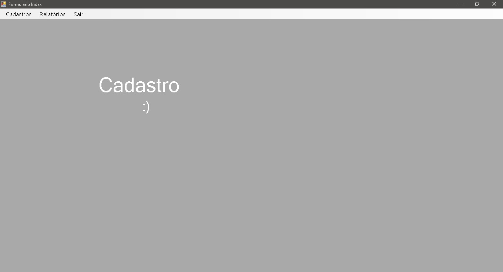
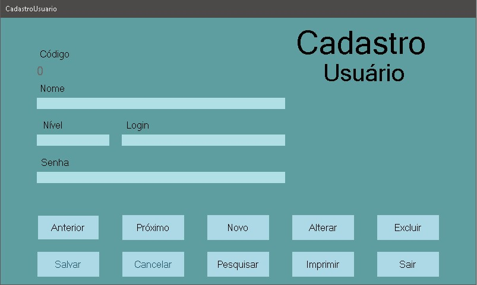
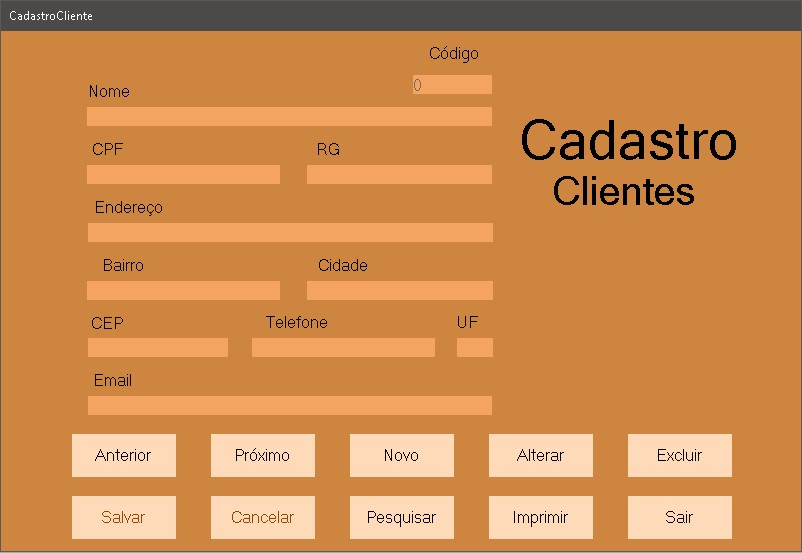
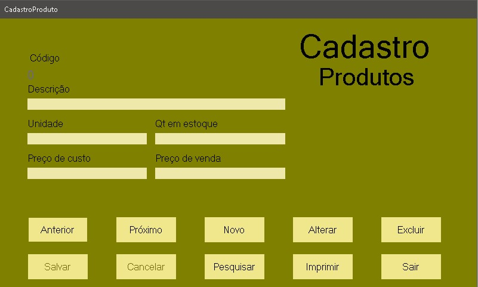

# Fomulario de Cadastros WFA
<ul>
<li>Formulário de cadastros feito com Windows Forms;</li>
<li>Atividade proposta na aula de Desenvolvimento de Sistemas;</li>
</ul>
# Telas do programa:
<h3>Tela inicial - Index</h3>

<h3>Tela de cadastro de usuário</h3>

<h3>Tela de cadastro de cliente</h3>

<h3>Tela de cadastro de produtos</h3>

